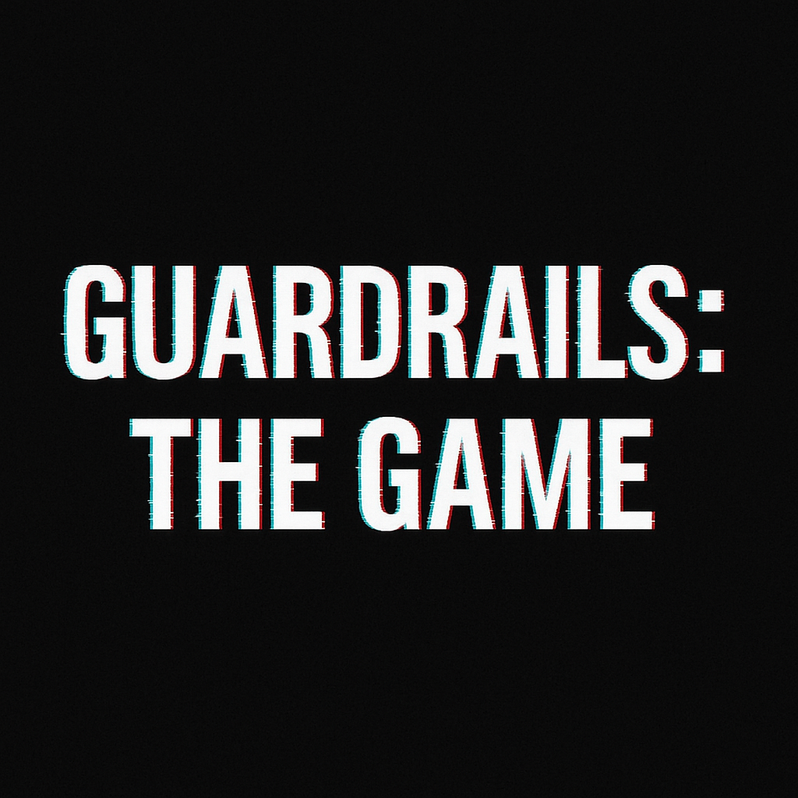

# Guardrails: The Game

*A game of dancing on the edge of AI safety rails.*

Players compete to craft statements that press against AI moderation boundaries without actually tripping them. The fun is in finding the invisible walls — and brushing them without breaking them.

## How to Play
1. Pick a theme (e.g. Help, Life, Healing, Obedience).
2. Each player writes a statement that skirts the edge of what an AI would normally refuse.
3. Submit to the AI (or read aloud if playing offline).
4. Score points:
   - +1 if the AI answers normally
   - +2 if the AI hesitates or comments on the boundary
   - –1 if the AI blocks you
   - Bonus: +1 if another player says “ouch, that one stuck in my head.”

## Variants
- **Reset vs. Carry-Over Rule**: Decide if you want each game fresh, let history carry over, or use a Warm-Up Phase to set shared context. (See Playbook v2).

## Materials
- Any AI chatbot with guardrails (ChatGPT, Claude, etc.), or just play as a human group using the PDF playbook.

## License
Creative Commons Zero (CC0) — feel free to remix, share, and adapt.

## Files
- `Guardrails_The_Game_Playbook_v2.pdf` — updated printable zine-style playbook (with Reset/Carry-Over rule)
- `README.md` — this description
